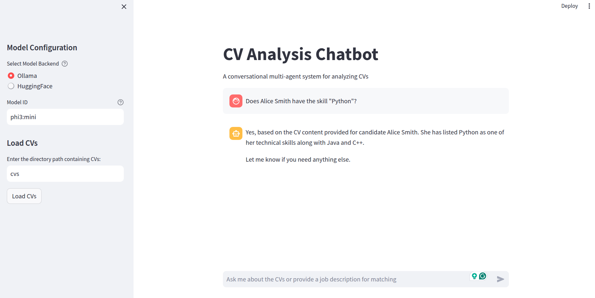

# CV Analyzer and Candidate Matching - A Multi-Agent System

A powerful CV analysis and candidate matching system that helps recruiters and hiring managers process resumes, answer questions about candidates, and match them with job descriptions. 

This system receives a path on the local file system, and retrieves all pdf files in the specified path. Next, it classifies which pdf files are CVs. It then analyzes the CVs and extract structural information such as skills and experiences. Finally, it can answer questions regarding the candidate CVs or it can rank candidates for a specified job description. 

## Features

- **CV Processing**
  - Automatic CV detection and classification
  - Structured information extraction (e.g., skills, experience, etc.)
  - PDF support with text extraction

- **Interactive QA System**
  - Ask questions about candidates' skills and experience
  - Get detailed answers based on CV content
  - Natural language interaction

- **Candidate Matching**
  - Match candidates against job descriptions
  - Get detailed scoring and explanations
  - Rank candidates based on suitability


## Architecture

The system uses a modular architecture with specialized agents and LangGraph for workflow management:

### Agents
- `DocumentClassifierAgent`: Identifies if a document is a CV/resume
- `CVAnalyzerAgent`: Extracts structured information from CVs
- `CVQAAgent`: Answers questions about candidates
- `MatchingAgent`: Ranks candidates against job requirements
- `RouterAgent`: Routes queries to appropriate agents

### LangGraph Workflow
The system uses LangGraph's `StateGraph` to manage conversation flow:


### Configuration

The system uses YAML files for configuration:

- `prompts.yaml`: Contains all system prompts and instructions for agents
  - Easily modify agent behavior by updating prompts
  - Centralized prompt management
  - Clear separation of logic and prompts

## Setup and Run

1. Install dependencies:
```bash
pip install -r requirements.txt
```

2. Set up the language model:
   - Using Ollama (default):
     ```bash
     ollama pull phi3:mini
     ```
   - Or using HuggingFace models (requires additional packages):
     ```bash
     pip install transformers torch accelerate
     ```

3. Run the application:
```bash
streamlit run app.py
```


## Usage Examples

Please note that pdf files in cvs folder are AI generated. Here are two examples:

1. **Ask Questions About Candidates**
- Does Alice Smith have the skill "Python"?


    - The system will analyze all candidates and answers the question by invoking the Candidate QA agent


2. **Match Candidates to Jobs**
- Rank candidates for the job position "software architect".


  - The system will analyze all candidates and provide a ranked list based on their match with the job requirements by invoking the matching agent





